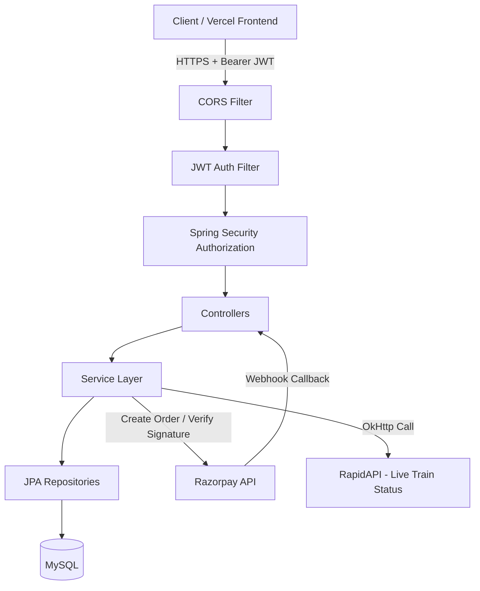
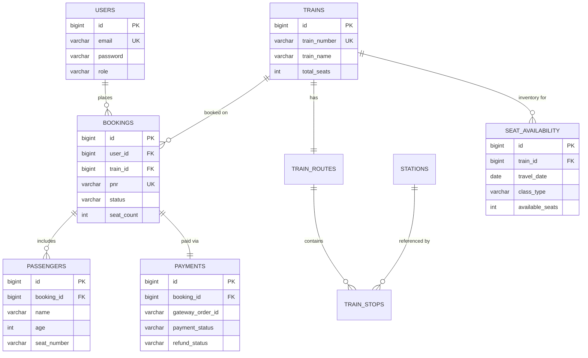
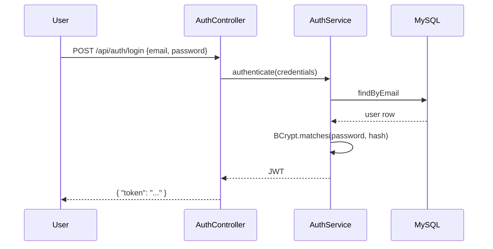
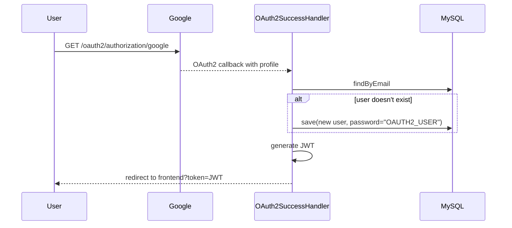
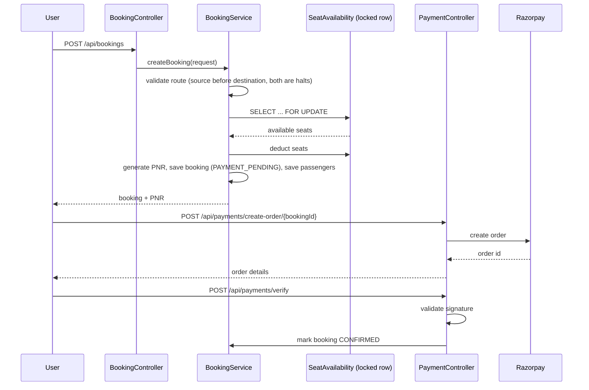

front end : https://indianrailclone.me/home
# IRCTC Backend

Railway ticket reservation system built on Spring Boot — auth, train search, seat inventory, booking, Razorpay payments, and live train tracking.

[](https://openjdk.org/projects/jdk/17/)
[](https://spring.io/projects/spring-boot)
[](https://www.mysql.com/)
[](https://www.docker.com/)
[](#license)

## Table of Contents

- [Overview](#overview)
- [Features](#features)
- [Screenshots](#screenshots)
- [Tech Stack](#tech-stack)
- [System Architecture](#system-architecture)
- [High Level Architecture](#high-level-architecture)
- [Folder Structure](#folder-structure)
- [Database Design](#database-design)
- [Authentication Flow](#authentication-flow)
- [Booking Flow](#booking-flow)
- [API Documentation](#api-documentation)
- [Installation](#installation)
- [Environment Variables](#environment-variables)
- [Local Development](#local-development)
- [Docker](#docker)
- [Deployment](#deployment)
- [Security](#security)
- [Performance](#performance)
- [Logging](#logging)
- [Error Handling](#error-handling)
- [Scheduler](#scheduler)
- [Project Decisions](#project-decisions)
- [Future Improvements](#future-improvements)
- [Testing](#testing)
- [API Examples](#api-examples)
- [Developer Notes](#developer-notes)
- [Contributing](#contributing)
- [License](#license)
- [Author](#author)

---

## Overview

IRCTC's actual booking system handles a scale most side projects never will, but the core problem it solves is a good one to build against: reserve a limited, shared resource (a seat) correctly under concurrent access, tie it to a payment, and keep the whole thing consistent when things fail halfway through.

This repo is a backend-only implementation of that problem — no frontend, no styling, just the API and the data model underneath it. I built it to get hands-on with the parts of backend engineering that don't show up in tutorials: row-level locking during checkout, JWT + OAuth2 coexisting in one security config, background jobs cleaning up abandoned bookings, and a payment integration that has to survive both a client-initiated confirm call *and* an asynchronous webhook telling you the same thing.

**Who this is for:** mainly a reference for myself and anyone evaluating my backend work. It's also a reasonably honest example of what a first production pass at a booking system looks like — including the parts that are still rough.

**Current state:** the primary booking flow (search → check seats → book → pay → confirm → cancel) works end to end against MySQL with proper locking. Seat allocation is capacity-based, not seat-number based — there's no coach/berth layout yet, which is the biggest functional gap. The payment webhook has a known bug (documented below, not swept under the rug). Refunds are simulated rather than wired to Razorpay's actual refund API.

**Business value:** shows the shape of a real reservation system — inventory contention, payment reconciliation, cancellation-driven inventory release — without needing IRCTC's actual scale to reason about.

**Technical value:** stateless JWT auth alongside OAuth2 social login, pessimistic locking under concurrent booking attempts, a scheduled job doing inventory cleanup, and a payment flow that has to be idempotent because Razorpay can call you back more than once.

---

## Features

| Feature | Status | Notes |
|---|---|---|
| Local Registration & Login | Done | BCrypt password hashing |
| Google OAuth2 Login | Done | OAuth users get a placeholder password; see [Security](#security) |
| JWT Authentication | Done | Stateless, `Authorization: Bearer` header |
| Role-Based Access Control | Done | `USER` / `ADMIN`, enforced via Spring Security matchers |
| Train Search | Done | Source/destination lookup with stop-order validation |
| Seat Availability | Done | Auto-initializes inventory on first query per train/date/class |
| Ticket Booking | Done | Pessimistic locking on seat inventory |
| Razorpay Checkout | Done | Order creation + signature verification |
| Razorpay Webhook | Buggy | Crashes on order ID parsing — see [Developer Notes](#developer-notes) |
| Booking Cancellation | Done | Releases seats, deletes passenger rows |
| Refunds | Simulated | Generates a fake reference ID, doesn't call Razorpay's refund API |
| Auto-Cancellation Scheduler | Done (duplicated) | Two schedulers currently run the same job — cleanup pending |
| Live Train Status | Done | Proxies Indian Railway data via RapidAPI + OkHttp |
| Swagger / OpenAPI | Done | `springdoc-openapi`, available at `/swagger-ui/index.html` |
| Docker | Done | `Dockerfile` included |
| Admin Dashboard APIs | Done | Station/train/route management, global booking & payment views |
| Email Notifications | Not wired up | `EmailService` exists but is never called |
| Seat/Coach Layout | Not built | No physical seat numbers — capacity counters only |
| Waitlist / RAC | Not built | Booking simply fails once inventory hits zero |
| Dynamic Fare Pricing | Not built | Flat `500 INR × seatCount` |
| Request Body Validation | Partially broken | `@Valid` annotations aren't applied on controllers |

---

## Screenshots

There's no frontend in this repository, so these are placeholders for reference once a client is built against the API.

<details>
<summary>Expand</summary>

| Page | Preview |
|---|---|
| Home / Dashboard | `docs/screenshots/home.png` |
| Login | `docs/screenshots/login.png` |
| Register | `docs/screenshots/register.png` |
| Train Search Results | `docs/screenshots/search.png` |
| Booking / Passenger Form | `docs/screenshots/booking.png` |
| Payment Checkout | `docs/screenshots/payment.png` |
| Admin Dashboard | `docs/screenshots/admin.png` |
| Swagger UI | `docs/screenshots/swagger.png` |
| Database Schema | `docs/screenshots/db-schema.png` |
| Architecture Diagram | `docs/screenshots/architecture.png` |

</details>

---

## Tech Stack

| Layer | Choice |
|---|---|
| Language | Java 17 |
| Framework | Spring Boot 3.x |
| Security | Spring Security — JWT (`io.jsonwebtoken`) + OAuth2 Client |
| Database | MySQL 8.x |
| ORM | Spring Data JPA / Hibernate |
| Payments | Razorpay Java SDK |
| Live Data | OkHttp3 → RapidAPI (Indian Railway status) |
| JSON | `org.json` |
| Build | Maven |
| API Docs | Springdoc OpenAPI (Swagger UI) |
| Boilerplate | Lombok |
| Container | Docker |
| Target Cloud | AWS EC2 (manual deploy, no managed services yet) |

---

## System Architecture



Nothing exotic here — it's a monolith on purpose. See [Project Decisions](#project-decisions) for why.

---

## High Level Architecture

| Layer | Responsibility |
|---|---|
| **Controller** | Parses HTTP input, delegates to services, returns DTOs. No business logic lives here. |
| **DTO** | Request/response shapes decoupled from JPA entities — keeps entity changes from leaking into the API contract. |
| **Mapper** | Converts between entities and DTOs. Hand-written, not MapStruct — small enough not to need the dependency. |
| **Service** | Where the actual rules live: route validation, locking, fare calculation, PNR generation. `@Transactional` boundaries are drawn here. |
| **Repository** | `JpaRepository` interfaces, a handful of custom `@Query` methods for locking and lookups. |
| **Entity** | Hibernate-mapped tables. Kept intentionally plain — no business logic on entities. |
| **Configuration** | `SecurityConfig`, `CorsConfig`, `RazorpayConfig`, OpenAPI config. |
| **Scheduler** | `@Scheduled` background jobs — currently just auto-cancellation (twice, which is a bug — see below). |
| **Security** | `JwtAuthenticationFilter`, `JwtUtil`, `OAuth2SuccessHandler`, `CustomUserDetailsService`. |

---

## Folder Structure

```
irctc-backend/
├── pom.xml
├── Dockerfile
├── src/
│   ├── main/
│   │   ├── java/com/irctc/irctc_backend/
│   │   │   ├── IrctcBackendApplication.java   # entry point
│   │   │   ├── config/                        # Security, CORS, Razorpay, OpenAPI
│   │   │   ├── controller/                    # REST endpoints
│   │   │   ├── dto/                           # request/response records
│   │   │   ├── entity/                        # JPA entities + enums
│   │   │   ├── exception/                     # GlobalExceptionHandler + custom exceptions
│   │   │   ├── Mapper/                        # entity <-> DTO conversion
│   │   │   ├── repository/                    # Spring Data JPA interfaces
│   │   │   ├── scheduler/                     # @Scheduled jobs
│   │   │   └── security/                      # JWT filter, JwtUtil, OAuth2 handler
│   │   └── resources/
│   │       ├── application.properties
│   │       ├── static/                        # unused
│   │       └── templates/                     # unused
│   └── test/java/com/irctc/irctc_backend/     # context load + stub tests
```

`static/` and `templates/` are empty — there's no server-rendered UI here, they're Spring Boot defaults I never removed.

---

## Database Design

9 tables, all normalized, no denormalized read models yet.

| Table | Purpose |
|---|---|
| `users` | Credentials + role (`USER`/`ADMIN`) |
| `trains` | Train number, name, total seat capacity |
| `train_routes` | 1:1 wrapper linking a train to its ordered stop list |
| `stations` | Station code/name lookup |
| `train_stops` | Ordered stops per route, unique on `(route_id, stop_order)` |
| `seat_availability` | Seats left per `(train_id, travel_date, class_type)` |
| `bookings` | PNR, status, travel date, class, seat count |
| `passengers` | Passenger rows per booking (`seat_number` is never populated) |
| `payments` | Razorpay order/payment/signature + refund tracking |



The only non-obvious constraint worth calling out: `seat_availability` has a unique index on `(train_id, travel_date, class_type)`, and every write to it goes through `PESSIMISTIC_WRITE` — that's the row that prevents two people from booking the last seat at the same time.

---

## Authentication Flow

Two paths in, one token type out.





**Token validation:** `JwtAuthenticationFilter` runs once per request, checks the `Authorization` header, validates the signature/expiry, and populates `SecurityContextHolder` with the extracted email + role. Route-level authorization (e.g. `/api/admin/**` → `ROLE_ADMIN`) is then handled declaratively in `SecurityConfig`.

**Refresh tokens:** not implemented. There's a single JWT with a fixed expiry — when it expires, the user re-authenticates. Fine for a project this size, not something I'd ship to production without adding rotation.

---

## Booking Flow



Step by step:

1. **Search** — `GET /api/trains/search` filters `train_stops` for trains that halt at both the source and destination, with source's `stop_order` before destination's.
2. **Seat check** — `GET /api/seat-availability` lazily creates an inventory row (`available_seats = train.totalSeats`) if none exists yet for that train/date/class combination.
3. **Booking** — locks the inventory row, deducts the requested seat count, generates a PNR (`PNR-XXXXXX`), writes passenger rows, sets status to `PAYMENT_PENDING`.
4. **Payment** — a Razorpay order is created for `seatCount * 500` (flat rate — see [limitations](#developer-notes)).
5. **Confirmation** — either the client hits `/api/payments/verify` with the Razorpay response, or the webhook fires independently. Both are meant to converge on the same state; right now only the client-verify path actually works reliably.
6. **Cancellation** — `DELETE /api/bookings/cancellations/{bookingId}` locks the same inventory row, adds the seats back, deletes passenger rows, marks the booking `CANCELLED`.
7. **Refund** — currently simulated: flips `payment_status`/`refund_status` and stamps a fake `REF-xxxxx` reference, no outbound call to Razorpay.
8. **Auto-cancellation** — a background job sweeps `PAYMENT_PENDING` bookings older than 10 minutes and cancels them the same way a user-initiated cancellation would.

---

## API Documentation

30 endpoints total — 16 GET, 12 POST, 2 DELETE, 0 PUT/PATCH. Full list below; interactive docs live at `/swagger-ui/index.html` once the app is running.

### Auth

| Method | Endpoint | Auth | Purpose | Success |
|---|---|---|---|---|
| POST | `/api/auth/register` | None | Create local account | 200, string message |
| POST | `/api/auth/login` | None | Get JWT | 200, `{token}` |
| GET | `/api/auth/login/google` | None | Kick off Google OAuth2 | 302 redirect |

### Trains, Stations, Seats

| Method | Endpoint | Auth | Purpose | Success |
|---|---|---|---|---|
| GET | `/api/stations` | USER/ADMIN | List stations | 200 |
| GET | `/api/trains` | USER/ADMIN | List trains | 200 |
| GET | `/api/trains/search` | USER/ADMIN | Search by `source`, `destination` | 200 |
| GET | `/api/seat-availability` | USER/ADMIN | Check seats (`trainId`, `travelDate`, `classType`) | 200 |

### Booking & Payments

| Method | Endpoint | Auth | Purpose | Success |
|---|---|---|---|---|
| POST | `/api/bookings` | USER/ADMIN | Create booking | 200, `BookingResponse` |
| GET | `/api/bookings/my-bookings` | USER/ADMIN | Own booking history | 200 |
| GET | `/api/passengers/{bookingId}` | USER/ADMIN | Passenger list (owner-only) | 200 / 400 `"Access denied"` |
| DELETE | `/api/bookings/cancellations/{bookingId}` | USER/ADMIN | Cancel booking | 200 |
| POST | `/api/payments/create-order/{bookingId}` | USER/ADMIN | Create Razorpay order | 200 |
| POST | `/api/payments/verify` | USER/ADMIN | Verify signature, confirm booking | 200 / 400 on bad signature |
| POST | `/api/refunds/{bookingId}` | USER/ADMIN | Simulated refund | 200 |

### Public

| Method | Endpoint | Auth | Purpose |
|---|---|---|---|
| GET | `/api/public/railway/train-status/{trainNumber}` | None | Live status via RapidAPI |
| POST | `/api/payments/webhook` | None (signature-checked) | Razorpay event callback |

### Admin

| Method | Endpoint | Auth | Purpose |
|---|---|---|---|
| POST/GET | `/api/admin/stations` | ADMIN | Manage stations |
| POST/GET | `/api/admin/trains` | ADMIN | Manage trains |
| POST | `/api/admin/routes/{trainId}/stops` | ADMIN | Add stop to route |
| GET | `/api/admin/routes/{trainId}` | ADMIN | View route |
| DELETE | `/api/admin/routes/stops/{stopId}` | ADMIN | Remove stop |
| POST | `/api/admin/seats/init` | ADMIN | Seed/override inventory |
| GET | `/api/admin/bookings` | ADMIN | Global booking audit |
| GET | `/api/admin/payments` | ADMIN | Global payment audit |

---

## Installation

### Prerequisites

| Tool | Version | Why |
|---|---|---|
| Java | 17+ | Runtime |
| Maven | 3.8+ | Build |
| MySQL | 8.x | Persistence |
| Docker | optional | Containerized run |
| Git | any recent | Source control |

```bash
git clone https://github.com/<your-username>/irctc-backend.git
cd irctc-backend
```

---

## Environment Variables

```env
# --- Server ---
SERVER_PORT=8080

# --- Database ---
DB_URL=jdbc:mysql://localhost:3306/irctc_db
DB_USERNAME=root
DB_PASSWORD=changeme

# --- JWT ---
JWT_SECRET=replace-with-a-long-random-string
JWT_EXPIRATION_MS=3600000

# --- Google OAuth2 ---
GOOGLE_CLIENT_ID=your-google-client-id
GOOGLE_CLIENT_SECRET=your-google-client-secret
OAUTH2_REDIRECT_URI=https://your-frontend.vercel.app/oauth/callback

# --- Razorpay ---
RAZORPAY_KEY_ID=rzp_test_xxxxxxxx
RAZORPAY_KEY_SECRET=your-razorpay-secret
RAZORPAY_WEBHOOK_SECRET=your-webhook-secret

# --- RapidAPI (Live Train Status) ---
RAPIDAPI_KEY=your-rapidapi-key
RAPIDAPI_HOST=irctc1.p.rapidapi.com
```

| Variable | Required | Notes |
|---|---|---|
| `DB_URL` / `DB_USERNAME` / `DB_PASSWORD` | Yes | `ddl-auto=update` — schema is created/updated on boot |
| `JWT_SECRET` | Yes | Signs and validates tokens; rotate for production |
| `GOOGLE_CLIENT_ID/SECRET` | Only if using Google login | From Google Cloud Console |
| `RAZORPAY_KEY_ID/SECRET` | Yes for payments | Use test keys locally |
| `RAZORPAY_WEBHOOK_SECRET` | Yes for webhook | Used to verify `X-Razorpay-Signature` |
| `RAPIDAPI_KEY` | Only for live tracking endpoint | Free tier is rate-limited |

---

## Local Development

```bash
# 1. Create the database
mysql -u root -p -e "CREATE DATABASE irctc_db"

# 2. Build
mvn clean install

# 3. Run
mvn spring-boot:run

# App is up at http://localhost:8080
# Swagger UI at http://localhost:8080/swagger-ui/index.html
```

Quick sanity check once it's running:

```bash
curl -X POST http://localhost:8080/api/auth/register \
  -H "Content-Type: application/json" \
  -d '{"name":"Test User","email":"test@example.com","password":"Password123"}'
```

Testing endpoints during development is easiest through Swagger — it handles the Bearer token header for you once you paste in a JWT from `/login`.

---

## Docker

```bash
# Build
docker build -t irctc-backend .

# Run standalone (expects a reachable MySQL)
docker run -p 8080:8080 \
  -e DB_URL=jdbc:mysql://host.docker.internal:3306/irctc_db \
  -e DB_USERNAME=root \
  -e DB_PASSWORD=changeme \
  -e JWT_SECRET=replace-me \
  irctc-backend
```

```yaml
# docker-compose.yml
version: "3.8"
services:
  mysql:
    image: mysql:8.0
    environment:
      MYSQL_DATABASE: irctc_db
      MYSQL_ROOT_PASSWORD: changeme
    ports:
      - "3306:3306"
    volumes:
      - mysql-data:/var/lib/mysql

  app:
    build: .
    depends_on:
      - mysql
    ports:
      - "8080:8080"
    environment:
      DB_URL: jdbc:mysql://mysql:3306/irctc_db
      DB_USERNAME: root
      DB_PASSWORD: changeme
      JWT_SECRET: replace-me

volumes:
  mysql-data:
```

```bash
docker compose up --build
```

---

## Deployment

Current target is a single AWS EC2 instance, no managed orchestration:

1. **EC2** — provision an instance, install Docker (or a JDK if running the jar directly).
2. **Reverse proxy** — Nginx in front of the Spring Boot process, forwarding `/` to `localhost:8080`.
3. **SSL** — Let's Encrypt via Certbot, terminated at Nginx.
4. **Environment variables** — set through a `.env` file consumed by `docker-compose` or systemd `EnvironmentFile`, never committed.
5. **Production build**:
   ```bash
   mvn clean package -DskipTests
   java -jar target/irctc-backend-0.0.1-SNAPSHOT.jar
   ```

There's no CI/CD pipeline wired up yet — deploys are manual (`git pull`, rebuild, restart). That's listed under [Future Improvements](#future-improvements), not something I'm pretending is already automated.

---

## Security

| Concern | Implementation | Notes |
|---|---|---|
| Password storage | BCrypt | Standard, no custom hashing |
| Auth transport | JWT, stateless | No server-side session state |
| Social login | Google OAuth2 | New users get a placeholder password (`"OAUTH2_USER"`) — currently stored **unhashed**, which is a real gap, not a hypothetical one |
| Authorization | Route-prefix based RBAC | `/api/admin/**` → `ROLE_ADMIN`, enforced in `SecurityConfig` |
| Request validation | JSR-380 annotations present, **not enforced** | `@Valid` is missing on controller method signatures, so bean validation is currently a no-op |
| SQL Injection | Hibernate/JPQL parameterized queries throughout | No raw string concatenation anywhere in the repository layer |
| XSS | JSON-only responses | No server-rendered HTML, so the usual injection surface doesn't apply here |
| CORS | Explicit allow-list (`CorsConfig`) | Covers localhost + the deployed frontend origin |
| CSRF | Disabled | Reasonable given there's no cookie-based session to forge |
| Rate limiting | None | Login and the public live-status endpoint are both open to abuse right now |

If I were pushing this to a real production environment tomorrow, the two things I'd fix before anything else are the plaintext OAuth2 password and the missing `@Valid` — both are one-line-ish fixes with outsized risk.

---

## Performance

- **Connection pooling** — HikariCP (Spring Boot default), untuned beyond the defaults.
- **Transactions** — service methods that touch more than one table are wrapped in `@Transactional`; booking and cancellation both need this since they touch `bookings`, `passengers`, and `seat_availability` together.
- **Lazy loading** — entity associations default to lazy; this has bitten me once with a `LazyInitializationException` outside a transaction boundary, worth watching if you extend the entity graph.
- **Concurrency** — `PESSIMISTIC_WRITE` locks on `seat_availability` rows during booking and cancellation. This is a correctness-first choice: it serializes writes per train/date/class, which is fine at the traffic this project actually sees, but wouldn't scale to IRCTC's real Tatkal-morning load without moving to something like optimistic locking with retries, or a queue in front of the hot rows.
- **Indexes** — unique indexes on `users.email`, `trains.train_number`, `bookings.pnr`, `stations.code`, and the composite `(train_id, travel_date, class_type)` on `seat_availability`.
- **Caching** — none yet. Station and route data barely change and are an obvious first Redis candidate; see [Future Improvements](#future-improvements).

---

## Logging

Standard SLF4J via Spring Boot's default Logback setup — nothing custom configured yet. Key business events (booking created, payment verified, auto-cancellation firing) are logged at `INFO`, exceptions at `ERROR` with stack traces via the global handler. No structured/JSON logging or log aggregation is wired up — that's a gap if this were headed to a real ops environment, tracked under future work.

---

## Error Handling

A `GlobalExceptionHandler` (`@RestControllerAdvice`) catches domain exceptions — `UserAlreadyExistsException`, invalid PNR lookups, access-denied checks on passenger retrieval — and maps them to a consistent JSON error shape with an appropriate HTTP status instead of letting a stack trace leak out as a 500. Generic/unexpected exceptions fall through to a catch-all that still returns structured JSON rather than the default Spring Boot whitelabel error page.

---

## Scheduler

`AutoCancelScheduler` runs every 60 seconds (`@Scheduled(fixedRate = 60000)`), looks for bookings sitting in `PAYMENT_PENDING` for more than 10 minutes, and runs them through the same cancellation logic a user-triggered cancel would use — releasing the held seats back into inventory and removing the passenger rows.

**Known issue:** there's a second, near-identical class, `BookingAutoCancelScheduler`, doing the exact same query on the exact same interval. It's leftover from an earlier refactor and hasn't been deleted yet — both currently run in parallel, which means duplicate queries and unnecessary lock contention on the same rows. This is first on the cleanup list.

---

## Project Decisions

**Why JWT over server-side sessions** — the API is meant to be consumed by a separate frontend (deployed independently on Vercel), so a stateless token fits better than sticky sessions; it also means the backend can scale horizontally without needing shared session storage.

**Why Spring Boot** — mature ecosystem for exactly this kind of layered CRUD-plus-business-rules app; Spring Data JPA, Spring Security, and Spring Security OAuth2 Client cover almost everything needed out of the box without hand-rolling auth plumbing.

**Why MySQL over a NoSQL store** — the data model is inherently relational (users → bookings → passengers → payments, trains → routes → stops), and the correctness requirement (no double-booked seats) leans on row-level locking and unique constraints that relational databases are built for.

**Why JPA/Hibernate over plain JDBC or a query builder** — trades some fine-grained SQL control for speed of development; for this project's query complexity (mostly straightforward joins, a handful of native locking queries), that trade was worth it. The one place I'd reconsider is the seat availability hot path, where raw SQL might give more predictable locking behavior under load.

**Why a monolith, not microservices** — a single team, single deployable, and a data model where almost every write touches more than one "domain" (booking touches seats, passengers, and eventually payments) argues against splitting this up. Microservices would add network calls and distributed transaction complexity for no real benefit at this scale — see [Future Improvements](#future-improvements) for where that calculus might change.

**Why Docker** — makes local setup reproducible (no "works on my machine" with MySQL versions) and keeps the deployment story simple for a single-instance EC2 target.

**Why layered architecture (Controller → Service → Repository)** — kept intentionally boring. It makes it obvious where to put new logic, and it's what most people reading this codebase will already know how to navigate.

---

## Future Improvements

Roughly in the order I'd tackle them:

| Area | Plan |
|---|---|
| Fix webhook crash | Look up payments by `gatewayOrderId` instead of parsing it as a numeric ID |
| Enforce request validation | Add `@Valid` across controllers, add missing `@Min`/`@Pattern`/`@Size` constraints |
| Remove duplicate scheduler | Delete `BookingAutoCancelScheduler`, keep one source of truth |
| Real refunds | Wire `RefundService` to Razorpay's actual Refund API |
| Dynamic fare engine | Distance × per-km rate by class, plus Tatkal/festival surcharges and concessions |
| Seat/coach layout | Real coach + berth model instead of a capacity counter |
| Waitlist & RAC | Queue-based promotion (`WL → RAC → CONFIRMED`) on cancellation |
| Redis caching | Station/route lookups and seat availability reads |
| Rate limiting | Bucket4j on login and the public tracking endpoint |
| Notification service | Actually invoke `EmailService`, add SMS/WhatsApp via a provider |
| Kafka | Decouple booking confirmation from downstream notification/audit writes |
| Microservices split | Only if traffic or team size actually justifies it — not a goal in itself |
| Elasticsearch | Faster train/route search once the dataset is large enough that SQL `LIKE` scans start to hurt |
| CI/CD | GitHub Actions — build, test, and deploy on merge to `main` |
| Observability | Actuator + Prometheus + Grafana for request latency, JVM metrics, and queue depth once there's a queue |

---

## Testing

- **Unit tests** — service-layer logic (route validation, PNR generation) is the priority target; coverage right now is thin and mostly context-load/stub tests, which is an honest gap rather than something to hide.
- **Integration tests** — none automated yet; verification has been manual through Swagger and Postman.
- **Manual verification** — a Postman collection covering the full booking → payment → cancellation lifecycle is the current source of truth for "does this still work."
- **Concurrency testing** — double-booking protection has been sanity-checked with concurrent requests via a quick JMeter run against the seat-availability endpoint, not part of an automated suite.

If I were prioritizing one thing here next, it'd be integration tests around the booking + payment flow specifically, since that's where a regression would actually cost someone money.

---

## API Examples

**Register**

```http
POST /api/auth/register
Content-Type: application/json

{
  "name": "Jane Doe",
  "email": "jane@example.com",
  "password": "Password123"
}
```
```json
"User registered successfully"
```

**Login**

```http
POST /api/auth/login
Content-Type: application/json

{
  "email": "jane@example.com",
  "password": "Password123"
}
```
```json
{
  "token": "eyJhbGciOiJIUzI1NiJ9.eyJzdWIiOiJqYW5lQGV4YW1wbGUuY29tIn0..."
}
```

**Book a ticket**

```http
POST /api/bookings
Authorization: Bearer <token>
Content-Type: application/json

{
  "trainId": 1,
  "sourceStationCode": "NDLS",
  "destinationStationCode": "BCT",
  "travelDate": "2026-08-15",
  "classType": "SL",
  "passengers": [
    { "name": "Alice Smith", "age": 30, "gender": "F" }
  ]
}
```
```json
{
  "id": 12,
  "pnr": "PNR-A8C3D9E2",
  "trainNumber": "12951",
  "trainName": "Mumbai Rajdhani",
  "travelDate": "2026-08-15",
  "classType": "SL",
  "seatCount": 1,
  "status": "PAYMENT_PENDING",
  "sourceStationCode": "NDLS",
  "destinationStationCode": "BCT"
}
```

**Verify payment**

```http
POST /api/payments/verify
Authorization: Bearer <token>
Content-Type: application/json

{
  "bookingId": 12,
  "razorpayOrderId": "order_M0d9Hda...",
  "razorpayPaymentId": "pay_9ad0Hja...",
  "razorpaySignature": "2bc84a8...",
  "paymentMethod": "CARD"
}
```
```json
"Payment verified & booking confirmed"
```

---

## Developer Notes

- The webhook bug is real and reproducible: `PaymentWebhookService` tries to parse Razorpay's alphanumeric order ID as a `Long`, which throws. Until it's fixed, don't rely on the webhook path in any environment where Razorpay might fire it — the client-side `/verify` call is the reliable path right now.
- There's leftover development scaffolding in `UserTestController` (`/api/test/**`) that inserts a plaintext-password test user. It's not called from any real flow, but it shouldn't ship — flagging it here rather than pretending it isn't there.
- A few classes are dead weight: `PassengerService` (superseded by logic inlined in `BookingService`), `EmailService` (written, never injected), the `RazorpayConfig` bean (unused — `PaymentService` builds its own `RazorpayClient` per call instead of injecting the configured bean, which is inconsistent and should be fixed), and a couple of unused DTOs (`AdminBooking`, `PaymentResponse`).
- `passengers.seat_number` is a column that's never populated — it's there for the seat-layout feature that hasn't been built yet, not a bug.
- Assumption baked into the route validation: a train's stops are strictly ordered and `halt = true` for both source and destination is required for a valid search result — this matches how Indian Railways actually publishes routes, but it means a station that's a technical stop-without-halt won't show up as bookable, which is intentional.
- If you're extending this: the seat-availability locking pattern (`SELECT ... FOR UPDATE` via `@Lock(LockModeType.PESSIMISTIC_WRITE)`) is the one piece of code I'd leave alone unless you've got a specific reason and a load test to back up the change.

---

## Contributing

1. Fork the repo and create a branch off `main`: `git checkout -b fix/webhook-order-id-lookup`.
2. Keep changes scoped — one fix or feature per PR, not a grab-bag.
3. Run `mvn clean install` locally before opening a PR; it should build clean.
4. If you're touching the booking or payment flow, describe how you tested concurrency/locking behavior in the PR description, not just "works on my machine."
5. Match the existing style — layered architecture, DTOs at the controller boundary, no business logic in entities.

Bug reports and issues are welcome, especially around the items already listed in [Developer Notes](#developer-notes) — no need to rediscover them, just reference the section and go straight to the fix.

---

## License

MIT — see [LICENSE](LICENSE) for the full text. Use it, fork it, ship it, no attribution required (though a star is always appreciated).

---

## Author

**Manish**
Backend developer focused on Java/Spring Boot systems — JWT-based auth, transactional service design, and REST API architecture.

- Background: internship experience building a Spring Boot SaaS platform (JWT, Redis, Docker, AWS CI/CD)
- Core stack: Java 17/21, Spring Boot 3, MySQL, Redis, Docker, AWS (EC2/RDS/CI-CD), REST APIs
- Open to SDE-1 / Backend / Full Stack roles

Issues and PRs on this repo are genuinely welcome — it's a project I'm actively iterating on, not a one-time upload.
